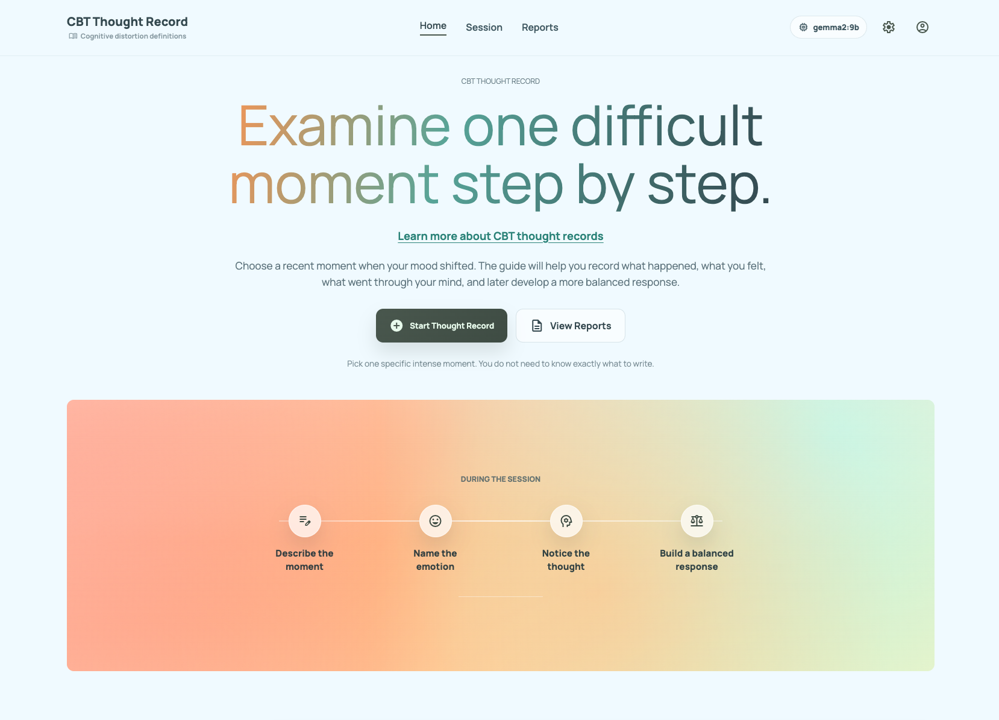
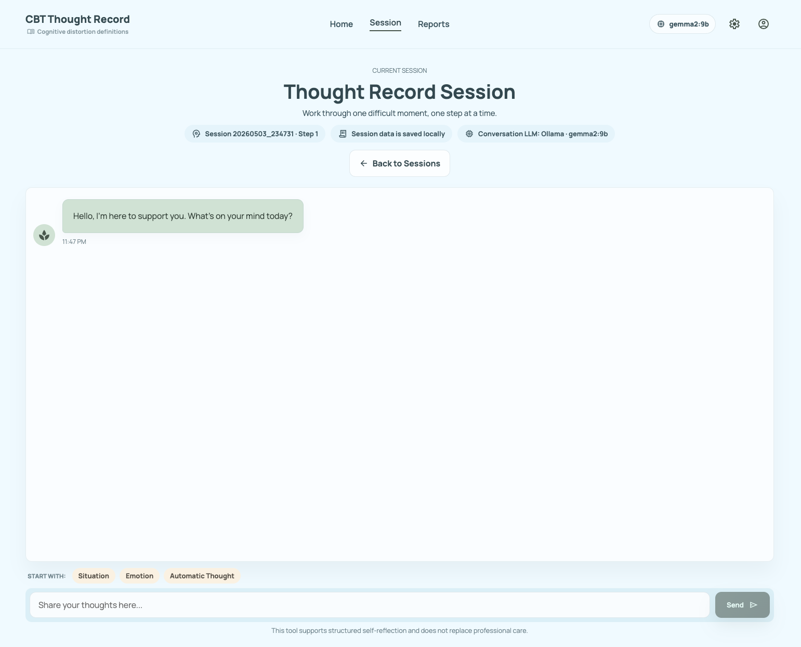
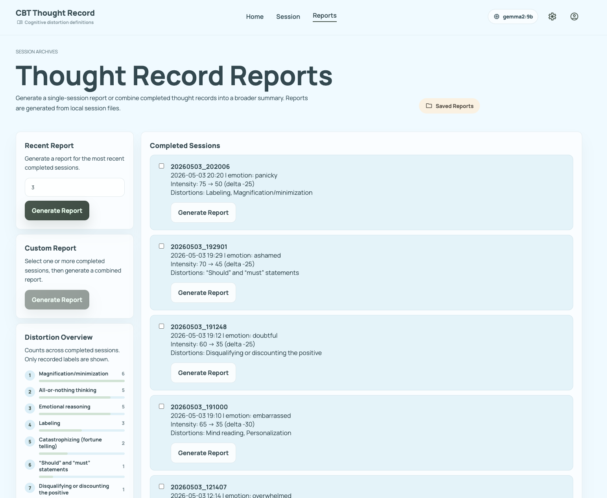

# CBT Thought Record 中文说明

CBT Thought Record 是一个本地运行的 CBT 思维记录网页应用。它会引导用户围绕一个具体情绪事件完成结构化 thought record，并把 session 和 report 保存为本地 JSON 文件。

本项目是自我反思和课程原型，不是医疗设备、诊断工具、治疗替代品或紧急支持服务。

## 项目功能

用户可以完成一个 7-step thought record：

- 描述具体情境
- 记录主要情绪和初始强度
- 识别 automatic thought
- 分别记录支持和不支持该想法的证据
- 识别可能的 cognitive distortions
- 写出更平衡的想法
- 重新评估情绪强度并查看总结

当前实现包括：

- 本地 Ollama 或 OpenAI-compatible API
- 本地 session JSON 保存，空 session 不落盘
- `completed`、`in_progress`、`stopped` session archive
- 未完成 session 可继续
- 单 session / 多 session report 生成
- 已保存 report 可重新查看，不重新调用 LLM
- Reports 页面显示 distortion 出现次数统计，只展示出现过的 label，并按次数排序
- 顶部书本图标和 Step 4 对话气泡内都可以查看 cognitive distortion definitions
- 可选 personal context，用于新 conversation 和 report summary

## 页面预览

### 首页



### Session



### Reports



## 使用方式

本项目有两种使用方式：

- **普通用户**：使用 Docker image 运行，不需要改代码。
- **开发者**：clone repository，本地开发时开两个 terminal，不需要 Docker。

详细中英文运行指南见 [RUNNING.md](RUNNING.md)。

## 普通用户：Docker 运行

### 1. 安装 Docker 和 Ollama

官方链接：

- Docker: https://docs.docker.com/installation/
- Ollama: https://ollama.com/download/

下载默认本地模型：

```bash
ollama pull gemma2:9b
```

### 2. 构建并运行

如果是从 GitHub clone 源码，在项目根目录运行：

```bash
docker build --no-cache -t cbt-thought-record-agent .
mkdir -p sessions reports
docker run --rm \
  -p 8000:8000 \
  -e TZ=Asia/Hong_Kong \
  -v "$PWD/sessions:/app/sessions" \
  -v "$PWD/reports:/app/reports" \
  cbt-thought-record-agent
```

然后打开：

```text
http://localhost:8000
```

如果已经发布了预构建 Docker image，用户可以跳过 `docker build`，在 `docker run` 最后一行使用发布后的 image 名称。

Docker image 默认使用本机 Ollama：

```text
Provider: ollama
Model: gemma2:9b
URL: http://host.docker.internal:11434/api/generate
```

注意：Docker 容器里的 `localhost` 指容器自己，不是用户电脑。如果手动修改 settings，Docker 模式下 Ollama URL 应使用 `host.docker.internal`。

Linux Docker Engine 如果无法识别 `host.docker.internal`，运行容器时加：

```bash
--add-host=host.docker.internal:host-gateway
```

## 使用 OpenAI-compatible API

复制环境变量示例：

```bash
cp .env.example .env
```

在 `.env` 中填写真实 key：

```text
OPENAI_API_KEY=your_real_api_key
```

运行 Docker 时传入 `.env`：

```bash
docker run --rm \
  -p 8000:8000 \
  -e TZ=Asia/Hong_Kong \
  --env-file .env \
  -v "$PWD/sessions:/app/sessions" \
  -v "$PWD/reports:/app/reports" \
  cbt-thought-record-agent
```

在页面 Settings 中选择：

```text
Provider: API
API / Ollama URL: https://api.openai.com/v1
Model: your_model_name
API key env var: OPENAI_API_KEY
```

其他 OpenAI-compatible 服务也可以使用，只需要把 URL 改成对应服务的 base URL 或完整 `/chat/completions` endpoint。

## 开发者：本地运行源码

本地开发不需要 Docker。开两个 terminal：

Terminal 1，启动后端：

```bash
uv sync
uv run uvicorn backend.api_app:app --reload --port 8000
```

Terminal 2，启动前端：

```bash
cd frontend
npm install
npm run dev
```

打开：

```text
http://127.0.0.1:5173
```

Vite dev server 会把 `/api/...` 请求代理到 `http://127.0.0.1:8000`。

## 配置说明

本地开发默认配置在 [backend/config.py](backend/config.py)：

```python
LLM_PROVIDER = "ollama"
LLM_URL = "http://localhost:11434/api/generate"
LLM_MODEL = "gemma2:9b"
API_KEY_ENV_VAR = "OPENAI_API_KEY"
```

Docker image 会通过 Dockerfile 设置 Docker 专用默认值：

```text
LLM_URL=http://host.docker.internal:11434/api/generate
```

因此本地开发和 Docker 使用不会互相影响。

页面 Settings 修改的配置会写入 `app_settings.json`。该文件已被 git ignore，不应上传。

## 数据和隐私

项目运行时会在本地保存：

- `sessions/session_<id>.json`
- `reports/report_<id>.json`
- `app_settings.json`
- `.env`

这些文件都不应该上传 GitHub。如果需要示例数据，应单独创建匿名化样例。

## 项目结构

```text
backend/
  agent.py            CBT agent 核心流程
  api_app.py          FastAPI API 和生产模式前端静态托管
  knowledge_base.py   CBT step guidance 和 distortion definitions
  report_service.py   Report 聚合和 LLM summary 生成
  storage.py          Session JSON 保存
frontend/
  src/                React 前端
  src/distortionGuide.ts  Step 4 和顶部书本入口使用的静态 distortion guide
Dockerfile            单镜像 Docker 打包
RUNNING.md            中英文用户运行指南
README.md             英文项目说明
README_DEV.md         更详细的开发记录
```

## 主要页面

- `/`：开始 thought record
- `/sessions`：session archive，可查看、继续或删除 session
- `/reports`：生成 report，并查看 distortion overview
- `/reports/saved`：查看已保存 report
- `/reports/session/<session_id>`：单 session report preview
- `/reports/multi?...`：多 session report preview

## 注意事项

- 空 session 不保存。
- 只有 completed sessions 可以生成 report。
- 生成 report 会调用当前配置的 LLM。
- 保存或重新打开已保存 report 不会再次调用 LLM。
- 删除 saved report 不会修改原始 session。
- 删除 session 不会自动删除已经保存的 report。
- Docker 时区可通过 `-e TZ=<timezone>` 修改。

## 相关文档

- [README.md](README.md)：英文项目说明
- [RUNNING.md](RUNNING.md)：中英文运行指南
- [README_DEV.md](README_DEV.md)：更详细的开发说明
- [demonstration.md](demonstration.md)：当前实现和 demo 记录
